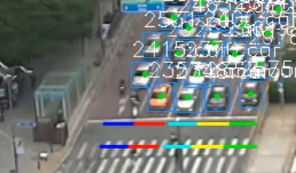

## 실제 교차로 데이터 수집 및 교통량 측정

### 1. 교차로 CCTV 영상 확보

도시 교통 정보 센터 개방 CCTV 데이터 활용

CCTV 1시간 영상 수집 

(혼잡한 금요일 오후 6시-7시)

### 2. Yolov7 기반 객체 탐지
yolov7 : 객체 탐지 모델
- 객체 위치 표시와 분류를 one-stage로 동시에 수행하는 모델
- 사용한 데이터 셋 : AI hub의 “교차로 위주의 CCTV 영상 데이터 이미지”

   | train | test  |
   |-------|-------|
   | 71396 | 12243 |
- GPU RTX 3090 2대로 분산학습
- 80 epoch 수행


<div align ="center">

</div>


Training Code
``` shell
python -m torch.distributed.launch --nproc_per_node 2 --master_port 9527 train.py --workers 8 --device 0,1 --sync-bn --batch-size 8 --data data/myconfig.yaml --img 1080 1920 --cfg cfg/training/yolov7x.yaml --weights '' --name yolov7x --hyp data/hyp.scratch.p5.yaml --epochs 80
```

### 3. Deepsort를 통한 객체 추적

Deepsort : 객체 추적을 위한 알고리즘

KalmanFilter와 Hungarian Algorithm을 사용한 추적 모델

`runs/train/yolov7x2/weights/best.pt` 의 weight 값을 사용하여 tracking을 진행함
``` shell
python detect_and_track.py
```


<div align ="center">

</div>


### 4. 교통량 및 v/c 계산
도로 용량 편람 분석 프로그랢 (KHCS)를 활용해 과포화 상태 입증
- 평균 v/c가 1.52로 과포화 상태


